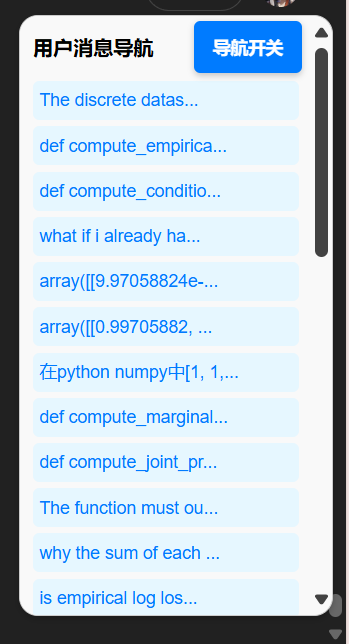

# ChatGPT 消息导航脚本

## 简介

这个脚本为 ChatGPT 提供了一个 **用户消息导航功能**，可以在对话中快速定位用户的发送消息，并支持切换对话时自动更新导航内容。

主要功能：
- **导航用户消息**：生成一个侧边导航栏，显示当前对话中的用户消息，并支持点击快速跳转。
- **动态更新**：在切换 ChatGPT 对话时，导航栏会自动更新，无需刷新页面。
- **一键隐藏/显示导航栏**：提供简单的按钮控制，用户可以自由选择是否显示导航栏。

---

## 安装指南

### 1. 安装 Tampermonkey 扩展
首先需要您在浏览器中安装 [Tampermonkey](https://www.tampermonkey.net/) 扩展，Tampermonkey支持以下浏览器：

- <a href="https://chrome.google.com/webstore/detail/dhdgffkkebhmkfjojejmpbldmpobfkfo" target="_blank">Chrome 扩展商店 - Tampermonkey</a>
- <a href="https://microsoftedge.microsoft.com/addons/detail/tampermonkey/iikmkjmpaadaobahmlepeloendndfphd" target="_blank">Edge 扩展商店 - Tampermonkey</a>
- <a href="https://addons.mozilla.org/firefox/addon/tampermonkey/" target="_blank">Firefox 附加组件商店 - Tampermonkey</a>

### 2. 安装脚本
点击下面的链接，一键安装脚本：

- <a href="https://github.com/telly3e/ChatGPT-message-navigation/raw/refs/heads/master/script.user.js" target="_blank">安装 ChatGPT 消息导航脚本</a>

安装后，您可以在 [ChatGPT](https://chatgpt.com) 网页中享受该功能。

---

## 功能展示

### 导航栏界面
- **圆角边框设计**：导航栏在页面右上角显示，支持隐藏/显示切换。
- **消息快速定位**：点击导航栏中的消息标题，页面将滚动到对应的用户消息位置。

### 隐藏/显示按钮
- **固定按钮**：位于页面右上角靠下一点的位置，随时控制导航栏显示状态。
- **简洁美观**：支持主题样式调整，方便用户交互。

---

## 更新日志

### v1.0.0
- 实现基本的用户消息导航功能。
- 支持动态检测对话切换。
- 提供隐藏/显示导航栏的控制按钮。

